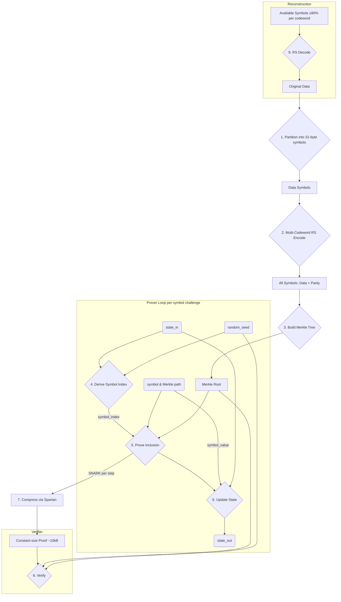

# Technical Implementation

This section provides a technical overview of the cryptographic implementation for contributors.

## Core Architecture

The system processes data through a pipeline of erasure coding, chunking, and Merkle tree construction before entering the recursive proving loop.

**Core Components:**

-   **`src/main.rs`**: CLI benchmark demonstrating the full PoR workflow.
-   **`src/api/`**: High-level API providing `prepare_file()`, `prove()`, `verify()`, and `reconstruct_file()`.
-   **`src/erasure.rs`**: Reed-Solomon erasure coding implementation.
-   **`src/merkle.rs`**: Merkle tree implementation using Poseidon hash with domain separation.
-   **`src/circuit/`**: The unified Nova `StepCircuit` for the PoR computation.
-   **`src/config.rs`**: Centralized configuration and public I/O layout.
-   **`src/ledger.rs`**: Ledger management, including versioned save/load and root validation on load.

## Data Encoding and Merkle Tree Construction

1.  **Symbol Partitioning**: Raw data is partitioned into fixed 31-byte symbols. The 31-byte size is the maximum that fits in a Pallas field element (255 bits), enabling symbols to encode directly as Merkle leaves.
2.  **Multi-Codeword Reed-Solomon**: Symbols are grouped into codewords of 231 data symbols. Reed-Solomon encoding over GF(2^8) generates 24 parity symbols per codeword (255 total). Files larger than 231 symbols use multiple independent codewords.
3.  **Merkle Tree Construction**: Each symbol encodes directly as a Pallas field element (little-endian byte order) to become a leaf. Internal nodes use Poseidon: `H(TAG_NODE, left, right)`. Tree is padded to next power of two.
4.  **Proof-of-Retrievability**: Verifying a Merkle proof proves possession of the field element. Because the encoding is reversible, this proves possession of the symbol's 31 bytes of file data.
5.  **Domain Separation**: All Poseidon operations use distinct tags to prevent cross-context collisions.

## Circuit Design

The `PorCircuit` implements Nova's `StepCircuit` trait. For each step, it proves:
1.  Correct calculation of the challenged leaf index.
2.  Knowledge of a valid Merkle path from the leaf to the public root.
3.  Correct evolution of the state via a hash chain: `state_out = H(state_in, leaf_value)`.

**Public I/O Vector Layout (Primary):**

The vector length is `2 + 4 * files_per_step` with the following sections:

1.  **Fixed (2):** `aggregated_root`, `state_in`.
2.  **Ledger indices (F):** `ledger_index_0 ... ledger_index_{F-1}`.
3.  **Depths (F):** `actual_depth_0 ... actual_depth_{F-1}`.
4.  **Seeds (F):** `seed_0 ... seed_{F-1}` (enables multi-batch aggregation).
5.  **Leaves (F):** `leaf_0 ... leaf_{F-1}`.

Notes:
-   The leaves section is initialized to zero in `z0_primary` and filled by the circuit; it is carried forward step-to-step by Nova.

**Security Properties:**

-   **Public Depth Binding:** Each slot's computed depth is enforced to equal its public depth input.
-   **Ledger Binding:** Public ledger indices and the aggregated root cryptographically prove that each file's `(root, depth)` commitment exists in the canonical `FileLedger`.
-   **Gating Logic:** Circuit slots are only processed if their public depth is greater than zero, allowing padding slots to be skipped securely.

## Important SNARK API Semantics

This project uses `arecibo`/Nova, which has a deliberate API quirk:

-   `RecursiveSNARK::new(...)` synthesizes step 0.
-   You must call `prove_step(...)` exactly `N` times for a batch with `N` iterations; the first call is a no-op that advances the internal counter, and only calls 2..N synthesize.
-   Verification must pass `num_steps = N`.

Our API abstracts this complexity away from the user.
