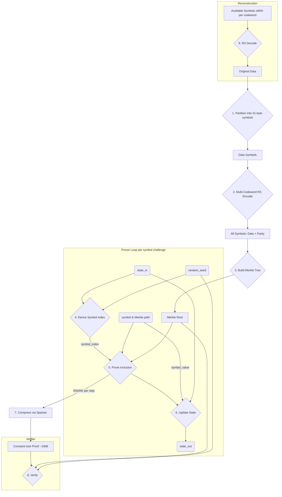

# Technical Implementation

This section provides a technical overview of the cryptographic implementation for contributors.

## Core Architecture

The system processes data through a pipeline of erasure coding, chunking, and Merkle tree construction before entering the recursive proving loop.

**Core Components:**

-   **`src/main.rs`**: Production storage node simulator with realistic multi-file proof aggregation, heterogeneous file sizes, and economic analysis.
-   **`src/api/`**: High-level unified API via `PorSystem` struct providing `prepare_file()`, `prove()`, and `verify()` methods.
  -   **`system.rs`**: `PorSystem` - unified API entry point
  -   **`plan.rs`**: Preprocessing logic shared between prove and verify
  -   **`prove.rs`**: Proof generation with automatic shape derivation
  -   **`verify.rs`**: Verification with secure ledger root pinning
  -   **`witness.rs`**: Circuit witness generation with guaranteed padding
  -   **`types.rs`**: Core data types (Challenge, Proof, FileMetadata, etc.)
-   **`src/circuit/`**: The unified Nova `StepCircuit` for PoR verification.
  -   **`synth.rs`**: Main circuit synthesis logic
  -   **`witness.rs`**: Witness data structures
  -   **`gadgets/`**: Low-level circuit components (Merkle, Poseidon, selection)
  -   **`debug.rs`**: Circuit uniformity fingerprinting (debug builds)
-   **`src/erasure.rs`**: Multi-codeword Reed-Solomon (GF(2^8), 231+24 symbols per codeword).
-   **`src/merkle.rs`**: Poseidon Merkle trees with domain separation.
-   **`src/ledger.rs`**: File ledger with aggregated Merkle tree of root commitments (rc values).
-   **`src/params.rs`**: Dynamic parameter generation with in-memory caching for different circuit shapes.
-   **`src/metrics.rs`**: Performance metrics and structured output for benchmarking.
-   **`src/config.rs`**: Centralized configuration, economic constants, and public I/O layout.
-   **`src/poseidon.rs`**: Domain-separated Poseidon hashing with cached constants.
-   **`benches/`**: Divan benchmark suite (`bench_main.rs`) for regression tracking (primitives, file prep, proving, verification, e2e).

## Data Encoding and Merkle Tree Construction

1.  **Symbol Partitioning**: Raw data is partitioned into fixed 31-byte symbols. The 31-byte size is the maximum that fits in a Pallas field element (255 bits), enabling symbols to encode directly as Merkle leaves.
2.  **Multi-Codeword Reed-Solomon**: Symbols are grouped into codewords of 231 data symbols. Reed-Solomon encoding over GF(2^8) generates 24 parity symbols per codeword (255 total). Files larger than 231 symbols use multiple independent codewords.
3.  **Merkle Tree Construction**: Each symbol encodes directly as a Pallas field element (little-endian byte order) to become a leaf. Internal nodes use Poseidon: `H(TAG_NODE, left, right)`. Tree is padded to next power of two.
4.  **Proof-of-Retrievability**: Verifying a Merkle proof proves possession of the field element. Because the encoding is reversible, this proves possession of the symbol's 31 bytes of file data.
5.  **Domain Separation**: All Poseidon operations use distinct tags to prevent cross-context collisions.

## Circuit Design

The `PorCircuit` implements Nova's `StepCircuit` trait. For each step, it proves:
1.  Correct calculation of the challenged leaf index via domain-separated hashing.
2.  Knowledge of a valid Merkle path from the leaf to the file root.
3.  File root commitment membership in the aggregated ledger (multi-file only).
4.  Correct evolution of the state via a hash chain: `state_out = H(TAG_STATE, state_in, leaf_value)`.

**Circuit Shape and Complexity:**

-   **Shape derivation**: `files_per_step = next_power_of_two(num_files)` for uniform structure
-   **Circuit cost**: `C_IVC = 100 × file_tree_depth` constraints (from protocol specification)
-   **Examples**:
    -   10 KB file (depth 9): 900 constraints
    -   100 KB file (depth 12): 1,200 constraints  
    -   1 MB file (depth 16): 1,600 constraints
    -   10 MB file (depth 19): 1,900 constraints

**Public I/O Vector Layout (Primary):**

The vector length is `2 + 4 * files_per_step` with the following sections:

1.  **Fixed (2):** `aggregated_root`, `state_in`.
2.  **Ledger indices (F):** `ledger_index_0 ... ledger_index_{F-1}` (canonical positions in ledger).
3.  **Depths (F):** `actual_depth_0 ... actual_depth_{F-1}` (for depth binding).
4.  **Seeds (F):** `seed_0 ... seed_{F-1}` (enables multi-batch aggregation with different block hashes).
5.  **Leaves (F):** `leaf_0 ... leaf_{F-1}` (challenged symbols, initially zero).

Notes:
-   The leaves section is initialized to zero in `z0_primary` and filled by the circuit; it is carried forward step-to-step by Nova.
-   Different seeds per file enable aggregating challenges from different block heights (different Bitcoin block hashes).

**Security Properties:**

-   **Public Depth Binding:** Each slot's computed depth is enforced to equal its public depth input via constraint.
-   **Ledger Binding:** Public ledger indices and the aggregated root cryptographically prove that each file's `rc = H(TAG_RC, root, depth)` commitment exists in the canonical `FileLedger`.
-   **Gating Logic:** Circuit slots are only processed if their public depth is greater than zero, allowing padding slots to be skipped without changing circuit structure.
-   **Root Commitment (rc):** Binds file root and depth to prevent depth-spoofing attacks.

## Parameter Caching and Shape Derivation

**Dynamic Circuit Shapes:**

The system supports dynamic circuit parameters based on the actual files being proven:
-   **Shape key**: `(files_per_step, file_tree_depth, aggregated_tree_depth)`
-   **files_per_step**: `next_power_of_two(num_files)` - ensures uniform structure
-   **file_tree_depth**: `max(file_depths)` - handles heterogeneous file sizes
-   **aggregated_tree_depth**: `ledger.depth()` for multi-file, 0 for single-file

**In-Memory Caching** (`src/params.rs`):
-   Parameters are expensive to generate (2-5 seconds)
-   Cached by shape key with LRU eviction (max 50 entries)
-   Subsequent proofs with the same shape use cached parameters instantly
-   Simulator displays "Parameter Load (cached)" when cache is hit

## Multi-File Proof Aggregation

**Protocol Feature:**

Storage nodes can aggregate multiple file challenges into a single constant-size proof:
-   **Input**: N file challenges with different seeds (from different block heights)
-   **Output**: Single ~10-12 KB proof covering all files
-   **Benefit**: Amortizes Bitcoin transaction fee across all challenges

**Implementation:**

1.  Files are sorted by file_id for deterministic ordering
2.  Ledger indices are computed for each file's rc value
3.  Circuit processes all files in a single IVC proof
4.  Different seeds per file (from different Bitcoin block hashes) are supported
5.  Proof size remains constant regardless of file count

**Economics:**
-   Single proof: ~$0.50 Bitcoin transaction fee
-   Cost per file: $0.50 / N where N = number of files
-   Example: 5 files → $0.10 per file challenge

## Performance Characteristics

From simulator output (typical values):

**File Preparation:**
-   10 KB file: ~10 ms (erasure coding + Merkle tree)
-   100 KB file: ~80 ms
-   1 MB file: ~800 ms
-   10 MB file: ~8 seconds

**Proof Generation:**
-   Parameter generation: 2-5 seconds (first time), ~0s (cached)
-   Single-file proof (100 symbols): ~20-30 seconds
-   Multi-file proof (5 files × 100 symbols): ~75 seconds
-   Memory usage: ~1-2 GB peak (with memory-profiling feature)

**Verification:**
-   Constant time: ~50-130 ms regardless of file count or symbol count
-   Verification time is independent of proof generation complexity

## Benchmarking and Testing

**Benchmark Suite** (`benches/bench_main.rs`):
-   Uses **Divan** for statistical benchmarking
-   Regression tracking for critical paths
-   Protocol-aligned file sizes (10KB, 1MB, 100MB)
-   Multi-file aggregation tests (1, 2, 8 files)
-   Run with: `cargo bench`

**Production Simulator** (`src/main.rs`):
-   Realistic storage node operation
-   Heterogeneous file sizes and staggered challenges
-   Shows circuit cost (C_IVC = 100 × depth), per-file coverage, and economics
-   Run with: `cargo run --release`

**Test Suite** (`tests/`):
-   Circuit uniformity regression tests
-   Security tests (ledger binding, depth spoofing, replay attacks)
-   E2E tests with variable file sizes and depths
-   Run with: `cargo test`

## Important SNARK API Semantics

This project uses `nova-snark`/Arecibo, which has a deliberate API quirk:

-   `RecursiveSNARK::new(...)` synthesizes step 0.
-   You must call `prove_step(...)` exactly `N` times for a batch with `N` iterations; the first call is a no-op that advances the internal counter, and only calls 2..N synthesize.
-   Verification must pass `num_steps = N`.

Our API abstracts this complexity away from the user.
