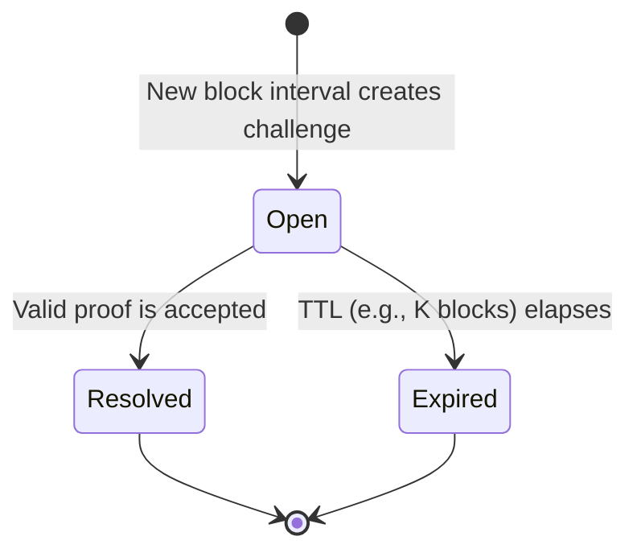
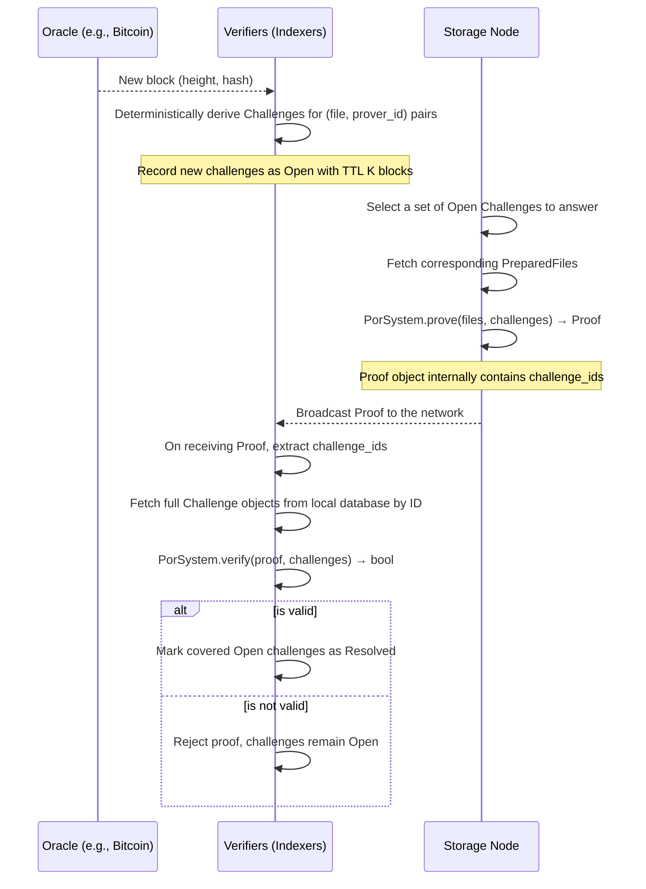

# Protocol Specification

This document describes the network-level protocol for decentralized storage auditing.

## Glossary

-   **Storage Node (Prover):** A network participant that commits to storing data and must generate proofs to demonstrate ongoing possession.
-   **Indexer (Verifier):** A network participant that validates proofs submitted by Storage Nodes and tracks the state of challenges.
-   **Symbol:** A 31-byte unit of data or parity. The 31-byte size is the maximum that fits in a Pallas field element (255 bits), enabling symbols to encode directly as Merkle leaves. Verifying a Merkle proof proves possession of the field element, and because the encoding is reversible, this proves possession of the symbol's 31 bytes of file data.
-   **Codeword:** A Reed-Solomon encoding unit over GF(2^8) containing 231 data symbols + 24 parity symbols (255 total). Files larger than 231 symbols use multiple independent codewords.
-   **Leaf:** A Merkle tree leaf is a symbol encoded as a Pallas field element via little-endian byte order.
-   **FileLedger:** An aggregated Merkle tree over root commitments of all files being tracked by the system.
-   **Root Commitment (rc):** A Poseidon hash binding a file's Merkle `root` and `depth`, preventing depth-spoofing attacks.
-   **State:** A value in a recursive hash chain (`state_out = H(state_in, leaf_value)`) that links sequential proof steps, preventing replay attacks.

## Oracle and Challenge Generation

-   The network uses a shared oracle (e.g., a Bitcoin block hash) to derive challenges deterministically at regular intervals.
-   For each interval and for each relevant file–prover pair, a `Challenge` is deterministically constructed from the `block_height`, `file_metadata`, a per-challenge `seed` derived from the oracle, and a `prover_id`.
-   Each `Challenge` has a deterministic `challenge_id` that uniquely identifies it on the network.

## Challenge Lifecycle

Challenges are created deterministically by all verifiers and transition through a simple lifecycle:



-   When a valid proof is broadcast, all `Open` challenges it covers are marked `Resolved`.
-   If a challenge is not resolved within its TTL, it becomes `Expired`, and the associated Storage Node is penalized according to metaprotocol rules.

## Protocol Flow



## Ledger & Aggregation

-   A `FileLedger` binds the set of files via an aggregated Merkle tree built over root commitments `rc = H(TAG_RC, root, depth)`.
-   Files are ordered canonically by `file_id` (lexicographic, e.g., `BTreeMap` order). Public ledger indices refer to this canonical ordering.
-   Multi-file proofs pin the ledger root as the aggregated root; single-file proofs pin the file root.
-   The verifier provides public ledger indices; the circuit trusts these (no range checks in circuit).

## Determinism & Canonical Ordering

-   Any set of files is treated deterministically by sorting by `file_id` whenever an order is required.
-   The map from `file_id` → `PreparedFile` is derived internally from `Vec<PreparedFile>` to avoid user ordering mistakes.
-   Seeds differ per file; domain separation prevents cross-file bias (multi-batch aggregation supported).

## Data Types

```rust
// Public commitment to a file
pub struct FileMetadata {
    pub root: FieldElement,
    pub file_id: String,            // hex(SHA256(data))
    pub padded_len: usize,          // Total Merkle leaves (power of 2)
    pub original_size: usize,       // Original file size in bytes
    pub filename: String,
}

// Derived values (computed from original_size and protocol constants):
impl FileMetadata {
    pub fn num_data_symbols(&self) -> usize;   // ceil(original_size / 31)
    pub fn num_codewords(&self) -> usize;      // ceil(num_data_symbols / 231)
    pub fn total_symbols(&self) -> usize;      // num_codewords × 255
}

/// The prover's representation of a file, containing the full Merkle tree.
pub struct PreparedFile { /* contains the full MerkleTree */ }

// A verifier's challenge for a single file-prover pair at a specific block height.
pub struct Challenge {
    pub file_metadata: FileMetadata,
    pub block_height: u64,
    pub seed: FieldElement,         // Per-file seed (enables multi-batch aggregation)
    pub num_challenges: usize,      // Recursive steps to prove for this file
    pub prover_id: String           // Identifier of the Storage Node being challenged
}

// Deterministic identity for a Challenge.
pub struct ChallengeID([u8; 32]);

// Final succinct proof that includes its coverage set.
pub struct Proof {
    // existing CompressedSNARK payload
    pub challenge_ids: Vec<ChallengeID>, // Exact ordered set of challenges covered
}

// Derivation for ChallengeID (using stable, cryptographic fields only)
challenge_id = H(TAG_CHALLENGE_ID, encode(block_height) || encode(seed) || encode(file_id) || encode(root) || encode(depth) || encode(num_challenges) || [encode(prover_id)])
```

## Proof Serialization

The system provides stable helpers to serialize and deserialize proofs for network transport.

```rust
let bytes = proof.to_bytes()?;
let parsed = Proof::from_bytes(&bytes)?;
```

The format is versioned, includes the `challenge_ids` vector, and rejects any trailing data.

### Encoding Notes

- Use a network-canonical encoding with explicit versioning and magic bytes.
- Fixed-width, little-endian encodings for integers (e.g., `block_height: u64`).
- Field elements are encoded in a canonical 32-byte form.
- `challenge_ids` are serialized as a length-prefixed vector of 32-byte IDs.
