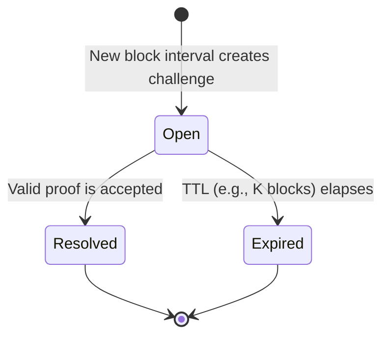
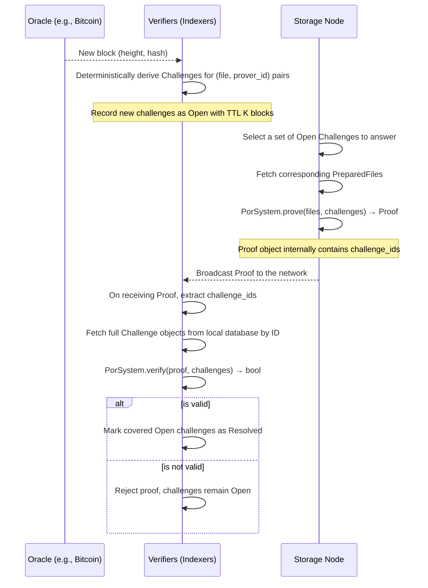
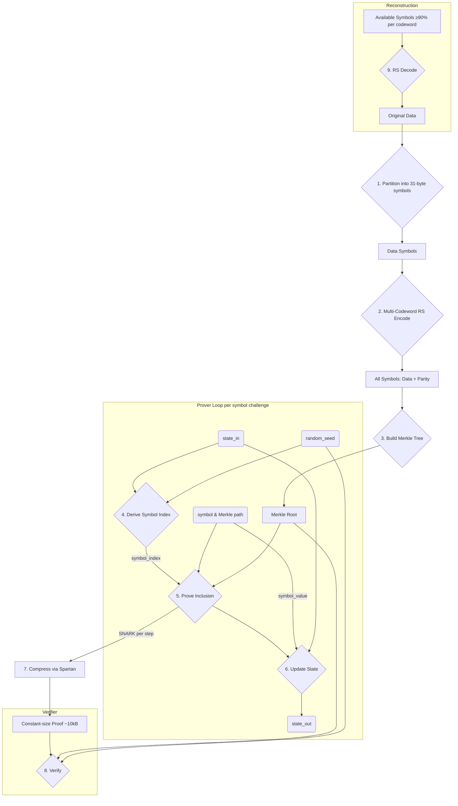

# Kontor Proof-of-Retrievability (PoR)

[](https://github.com/KontorProtocol/Kontor-Crypto/actions)
[](LICENSE)

> **⚠️ WARNING: This code is unaudited and experimental. Use at your own risk.**

This project implements a Proof-of-Retrievability (PoR) system designed to provide economically enforceable guarantees that Storage Nodes are actually storing the data they have committed to. It is a core component for decentralized storage metaprotocols where a network of Indexers (Verifiers) must continuously audit Storage Nodes (Provers).

The system uses [Nova](https://eprint.iacr.org/2021/370) recursive SNARKs via the [`arecibo`](https://github.com/microsoft/arecibo) library to generate constant-size (~10 kB) cryptographic proofs that a prover possesses a specific set of data. These proofs are efficient to verify (~30ms), making it feasible to enforce storage guarantees at scale.

### Core Capabilities

-   Partition files into fixed 31-byte symbols for direct field element encoding.
-   Apply multi-codeword Reed-Solomon (GF(2^8)) for fault tolerance.
-   Generate Poseidon Merkle trees over all symbols (data + parity).
-   Create recursive SNARKs proving possession of randomly sampled symbols.
-   Compress proofs to constant ~10 kB size regardless of file count or challenge count.
-   Support dynamic circuit parameters with in-memory caching.
-   Reconstruct original files from partial symbol availability (≥90% per codeword).

## Glossary

-   **Storage Node (Prover):** A network participant that commits to storing data and must generate proofs to demonstrate ongoing possession.
-   **Indexer (Verifier):** A network participant that validates proofs submitted by Storage Nodes and tracks the state of challenges.
-   **Symbol:** A 31-byte unit of data or parity. The 31-byte size is the maximum that fits in a Pallas field element (255 bits), enabling symbols to encode directly as Merkle leaves. Verifying a Merkle proof proves possession of the field element, and because the encoding is reversible, this proves possession of the symbol's 31 bytes of file data.
-   **Codeword:** A Reed-Solomon encoding unit over GF(2^8) containing 231 data symbols + 24 parity symbols (255 total). Files larger than 231 symbols use multiple independent codewords.
-   **Leaf:** A Merkle tree leaf is a symbol encoded as a Pallas field element via little-endian byte order.
-   **FileLedger:** An aggregated Merkle tree over root commitments of all files being tracked by the system.
-   **Root Commitment (rc):** A Poseidon hash binding a file's Merkle `root` and `depth`, preventing depth-spoofing attacks.
-   **State:** A value in a recursive hash chain (`state_out = H(state_in, leaf_value)`) that links sequential proof steps, preventing replay attacks.

## System Protocol

This section describes the network-level protocol for decentralized storage auditing.

### Oracle and Challenge Generation

-   The network uses a shared oracle (e.g., a Bitcoin block hash) to derive challenges deterministically at regular intervals.
-   For each interval and for each relevant file–prover pair, a `Challenge` is deterministically constructed from the `block_height`, `file_metadata`, a per-challenge `seed` derived from the oracle, and a `prover_id`.
-   Each `Challenge` has a deterministic `challenge_id` that uniquely identifies it on the network.

### Challenge Lifecycle

Challenges are created deterministically by all verifiers and transition through a simple lifecycle:



-   When a valid proof is broadcast, all `Open` challenges it covers are marked `Resolved`.
-   If a challenge is not resolved within its TTL, it becomes `Expired`, and the associated Storage Node is penalized according to metaprotocol rules.

### Protocol Flow



### Ledger & Aggregation

-   A `FileLedger` binds the set of files via an aggregated Merkle tree built over root commitments `rc = H(TAG_RC, root, depth)`.
-   Files are ordered canonically by `file_id` (lexicographic, e.g., `BTreeMap` order). Public ledger indices refer to this canonical ordering.
-   Multi-file proofs pin the ledger root as the aggregated root; single-file proofs pin the file root.
-   The verifier provides public ledger indices; the circuit trusts these (no range checks in circuit).

### Determinism & Canonical Ordering

-   Any set of files is treated deterministically by sorting by `file_id` whenever an order is required.
-   The map from `file_id` → `PreparedFile` is derived internally from `Vec<PreparedFile>` to avoid user ordering mistakes.
-   Seeds differ per file; domain separation prevents cross-file bias (multi-batch aggregation supported).

## API Reference

The high-level API centers on a `PorSystem` object, which consolidates setup, proving, and verification concerns.

### Core Interface

```rust
// Construction
struct PorSystem<'a> { /* holds reference to FileLedger */ }

impl<'a> PorSystem<'a> {
    pub fn new(ledger: &'a FileLedger) -> Self;

    // Prepares a file for proving. Symbol size (31 bytes) and codeword structure (231+24)
    // are fixed by protocol constants in config.rs.
    pub fn prepare_file(
        &self,
        data: &[u8],
        filename: &str,
    ) -> Result<(PreparedFile, FileMetadata)>;

    // Generates a single compact proof for any set of open Challenges.
    pub fn prove(
        &self,
        files: Vec<&PreparedFile>,
        challenges: &[Challenge],
    ) -> Result<Proof>;

    // Verifies a proof against the Challenges it claims to answer.
    pub fn verify(
        &self,
        proof: &Proof,
        challenges: &[Challenge],
    ) -> Result<bool>;
}
```

### Data Types

```rust
// Public commitment to a file
pub struct FileMetadata {
    pub root: FieldElement,
    pub file_id: String,            // hex(SHA256(data))
    pub padded_len: usize,          // Total Merkle leaves (power of 2)
    pub original_size: usize,       // Original file size in bytes
    pub filename: String,
}

// Derived values (computed from original_size and protocol constants):
impl FileMetadata {
    pub fn num_data_symbols(&self) -> usize;   // ceil(original_size / 31)
    pub fn num_codewords(&self) -> usize;      // ceil(num_data_symbols / 231)
    pub fn total_symbols(&self) -> usize;      // num_codewords × 255
}

/// The prover's representation of a file, containing the full Merkle tree.
pub struct PreparedFile { /* contains the full MerkleTree */ }

// A verifier's challenge for a single file-prover pair at a specific block height.
pub struct Challenge {
    pub file_metadata: FileMetadata,
    pub block_height: u64,
    pub seed: FieldElement,         // Per-file seed (enables multi-batch aggregation)
    pub num_challenges: usize,      // Recursive steps to prove for this file
    pub prover_id: String           // Identifier of the Storage Node being challenged
}

// Deterministic identity for a Challenge.
pub struct ChallengeID([u8; 32]);

// Final succinct proof that includes its coverage set.
pub struct Proof {
    // existing CompressedSNARK payload
    pub challenge_ids: Vec<ChallengeID>, // Exact ordered set of challenges covered
}

// Derivation for ChallengeID (using stable, cryptographic fields only)
challenge_id = H(TAG_CHALLENGE_ID, encode(block_height) || encode(seed) || encode(file_id) || encode(root) || encode(depth) || encode(num_challenges) || [encode(prover_id)])
```

### Usage Example

A complete example demonstrating the API workflow:

```rust,no_run
use kontor_crypto::api::{
    prepare_file, Challenge, FieldElement, PorSystem,
    tree_depth_from_metadata,
};
use kontor_crypto::FileLedger;

// 1. Prepare the file with fixed Reed-Solomon encoding (231 data + 24 parity symbols per codeword)
let my_data = b"This is a test file for the PoR system.";
let (prepared_file, metadata) = prepare_file(my_data, "test.dat").unwrap();

// 2. Create ledger and add the file
let mut ledger = FileLedger::new();
ledger.add_file(metadata.file_id.clone(), metadata.root, tree_depth_from_metadata(&metadata)).unwrap();

// 3. Create PorSystem and challenge
let system = PorSystem::new(&ledger);
let num_challenges = 5;
let seed = FieldElement::from(12345u64); // Deterministic seed
let challenge = Challenge::new(metadata.clone(), 1000, num_challenges, seed, String::from("node_1"));

// 4. Generate proof using the unified API
let files = vec![&prepared_file];
let proof = system.prove(files, &[challenge.clone()]).unwrap();

// 5. Verify the proof
let is_valid = system.verify(&proof, &[challenge]).unwrap();
assert!(is_valid, "Proof verification failed!");

println!("Proof successfully generated and verified with Nova PoR API.");
```

### Proof Serialization

The system provides stable helpers to serialize and deserialize proofs for network transport.

```rust
let bytes = proof.to_bytes()?;
let parsed = Proof::from_bytes(&bytes)?;
```

The format is versioned, includes the `challenge_ids` vector, and rejects any trailing data.

#### Encoding Notes

- Use a network-canonical encoding with explicit versioning and magic bytes.
- Fixed-width, little-endian encodings for integers (e.g., `block_height: u64`).
- Field elements are encoded in a canonical 32-byte form.
- `challenge_ids` are serialized as a length-prefixed vector of 32-byte IDs.

## Technical Implementation

This section provides a technical overview of the cryptographic implementation for contributors.

### Core Architecture

The system processes data through a pipeline of erasure coding, chunking, and Merkle tree construction before entering the recursive proving loop.



**Core Components:**

-   **`src/main.rs`**: CLI benchmark demonstrating the full PoR workflow.
-   **`src/api/`**: High-level API providing `prepare_file()`, `prove()`, `verify()`, and `reconstruct_file()`.
-   **`src/erasure.rs`**: Reed-Solomon erasure coding implementation.
-   **`src/merkle.rs`**: Merkle tree implementation using Poseidon hash with domain separation.
-   **`src/circuit/`**: The unified Nova `StepCircuit` for the PoR computation.
-   **`src/config.rs`**: Centralized configuration and public I/O layout.
-   **`src/ledger.rs`**: Ledger management, including versioned save/load and root validation on load.

### Data Encoding and Merkle Tree Construction

1.  **Symbol Partitioning**: Raw data is partitioned into fixed 31-byte symbols. The 31-byte size is the maximum that fits in a Pallas field element (255 bits), enabling symbols to encode directly as Merkle leaves.
2.  **Multi-Codeword Reed-Solomon**: Symbols are grouped into codewords of 231 data symbols. Reed-Solomon encoding over GF(2^8) generates 24 parity symbols per codeword (255 total). Files larger than 231 symbols use multiple independent codewords.
3.  **Merkle Tree Construction**: Each symbol encodes directly as a Pallas field element (little-endian byte order) to become a leaf. Internal nodes use Poseidon: `H(TAG_NODE, left, right)`. Tree is padded to next power of two.
4.  **Proof-of-Retrievability**: Verifying a Merkle proof proves possession of the field element. Because the encoding is reversible, this proves possession of the symbol's 31 bytes of file data.
5.  **Domain Separation**: All Poseidon operations use distinct tags to prevent cross-context collisions.

### Circuit Design

The `PorCircuit` implements Nova's `StepCircuit` trait. For each step, it proves:
1.  Correct calculation of the challenged leaf index.
2.  Knowledge of a valid Merkle path from the leaf to the public root.
3.  Correct evolution of the state via a hash chain: `state_out = H(state_in, leaf_value)`.

**Public I/O Vector Layout (Primary):**

The vector length is `2 + 4 * files_per_step` with the following sections:

1.  **Fixed (2):** `aggregated_root`, `state_in`.
2.  **Ledger indices (F):** `ledger_index_0 ... ledger_index_{F-1}`.
3.  **Depths (F):** `actual_depth_0 ... actual_depth_{F-1}`.
4.  **Seeds (F):** `seed_0 ... seed_{F-1}` (enables multi-batch aggregation).
5.  **Leaves (F):** `leaf_0 ... leaf_{F-1}`.

Notes:
-   The leaves section is initialized to zero in `z0_primary` and filled by the circuit; it is carried forward step-to-step by Nova.

**Security Properties:**

-   **Public Depth Binding:** Each slot's computed depth is enforced to equal its public depth input.
-   **Ledger Binding:** Public ledger indices and the aggregated root cryptographically prove that each file's `(root, depth)` commitment exists in the canonical `FileLedger`.
-   **Gating Logic:** Circuit slots are only processed if their public depth is greater than zero, allowing padding slots to be skipped securely.

### Important SNARK API Semantics

This project uses `arecibo`/Nova, which has a deliberate API quirk:

-   `RecursiveSNARK::new(...)` synthesizes step 0.
-   You must call `prove_step(...)` exactly `N` times for a batch with `N` iterations; the first call is a no-op that advances the internal counter, and only calls 2..N synthesize.
-   Verification must pass `num_steps = N`.

Our API abstracts this complexity away from the user.

## Developer Guide

### CLI Usage

A CLI is provided for large-scale proving and verification runs, as well as API demonstrations.

**Examples:**
```bash
# Run with small, approachable defaults (3 files, challenge 2, 3 steps each)
cargo run --release

# Run large-scale benchmark
cargo run --release -- \
  --total-files 1000 \
  --challenged-files 100 \
  --num-challenges 100
```

**Flags:**

-   `--total-files <N>`: Total files to prepare and add to the ledger (default: 3).
-   `--challenged-files <K>`: Subset of files to prove (default: 2).
-   `--num-challenges <C>`: Recursive steps to prove for *each* challenged file (default: 3).
-   `--file-size <bytes>`: Size of synthetic data for each file.
-   `--no-verify`: Skip the verification phase.
-   `-v`/`-vv`: Increase logging verbosity to DEBUG/TRACE.

### Test Suite

The project includes extensive unit and integration tests. Run all tests with:
```bash
cargo install cargo-nextest
cargo nextest run
```

### Running Benchmarks

Microbenchmarks and a small end-to-end flow are available via the `bench` binary:
```bash
cargo run --release --bin bench
```

### Performance Characteristics

-   Proof Size: ~10 kB (constant across challenge count and file set within a shape).
-   Verification Time: ~30 ms for compressed SNARK verification.
-   Proving Time: Approximately linear in the number of recursive steps.

### Errors and Failure Modes

Key error variants surfaced at API boundaries (see `NovaPoRError`):

-   `InvalidInput`, `InvalidChallengeCount`, `ChallengeMismatch` (e.g., non-uniform `num_challenges` across the batch).
-   `FileNotFound`, `FileNotInLedger`, `MetadataMismatch`.
-   `MerkleTree`, `Circuit`, `Snark`.
-   `Serialization`, `IO`.

### Enabling Git Hooks

This project includes a pre-push hook to run tests and a security audit. Enable it with:
```bash
git config core.hooksPath .githooks
```
